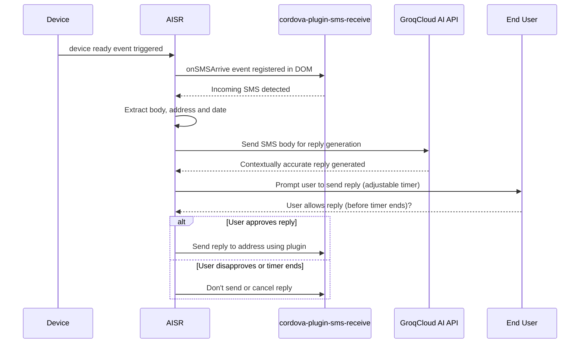

# AISR

   

	AISR is an attempt to employ AI to autonomously generate intelligent and contextually accurate replies to incoming SMS messages on Android.

## How it Works

```mermaid
sequenceDiagram
    participant Device as Device
    participant CordovaApp as AISR
    participant SMSReceive as cordova-plugin-sms-receive
    participant AI as GroqCloud AI API
    participant User as End User

    Device->>CordovaApp: device ready event triggered
    CordovaApp->>SMSReceive: onSMSArrive event registered in DOM
    SMSReceive-->>CordovaApp: Incoming SMS detected
    CordovaApp->>CordovaApp: Extract body, address and date
    CordovaApp->>AI: Send SMS body for reply generation
    AI-->>CordovaApp: Contextually accurate reply generated
    CordovaApp->>User: Prompt user to send reply (adjustable timer)
    User-->>CordovaApp: User allows reply (before timer ends)?
    alt User approves reply
        CordovaApp->>SMSReceive: Send reply to address using plugin
    else User disapproves or timer ends
        CordovaApp->>SMSReceive: Don't send or cancel reply
    end
```