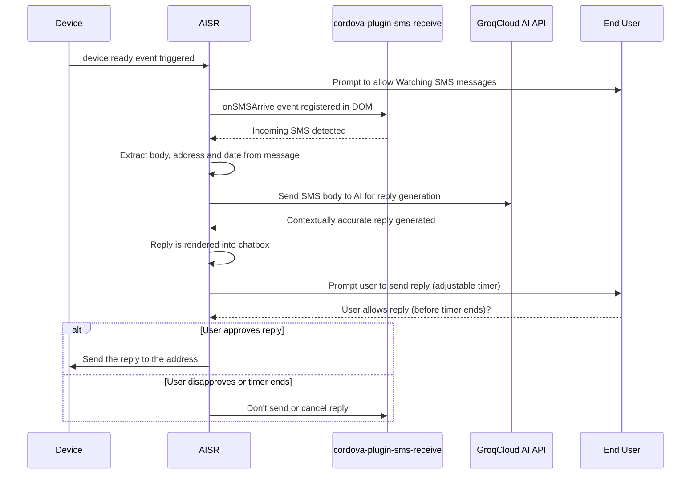

# AISR

   

	AISR is an attempt to employ AI to generate intelligent and contextually accurate replies to incoming SMS messages on Android.

---

 *Preview Images Here*

 

|  Source | Download ``.apk`` |
|---------|----------|
| *Github* | [link](www.githhub.com) |
| *F-Droid* | N/A |
| *Playstore* | N/A |

## 🤔 How It Works

   
A step-by-step breakdown

  
  
   1. **Device Initialization**: 
       - The app is launched, `deviceready` event is fired, it signifies the app is ready to interact with native plugins and features via cordova.
    
   2. **Registering the SMS Listener**:
       - After firing the `deviceready` event, if SMS watching is allowed, an event listener ``onSMSArrive`` from ``cordova-plugin-sms-receive`` is registered. This listener is responsible for detecting incoming SMS messages on the host device.
       
       > This is assuming that the Phone and SMS permission is allowed.
    
   3. **Capturing Incoming SMS**:
       - When a new SMS message is detected, `onSMSArrive` event is triggered.  We proceed to extract the SMS data, specifically the message body, sender's address and the current date.
    
   4. **AI-Powered Response Generation**:
       - The extracted SMS body along with the last nth messages are sent to Groqcloud AI API for analysis in order to generate a contextually accurate reply.
       
       > A system prompt can be set-up to allow a personalized processing for the message.
    
   5. **User Interaction**:
       - After the AI generates a reply, the app prompts the user to review and approve the response. An adjustable timer is initiated, giving the user a specified amount of time to approve or modify the reply.
    
   6. **Automated Reply**:
       - If the user approves the AI-generated reply within the given time, the reply is sent back to the original sender.
       
       If the timer expires without user intervention, the app can either send the reply automatically or cancel the operation based on predefined settings.
  

## ✨Features

Here are some of the key features included in the app, aimed at making things more convenient and customizable ..

* [x] Customizable System Prompt
    > This will allow the user to tweak the system prompt so the generated replies suit their preferences and personalities.

* [x] Voice enabled interactions
    > Automatically reads incoming messages aloud and voices the AI-generated reply. Users can choose from various voices and respond with "yes" to send the reply or "no" to cancel it..

* [ ] Suggested Replies
    > Provides context-aware replies by analyzing the chat history and presents relevant, pre-formulated replies that users can select and send back. Suggested Replies adapt to the user's communication style over time, providing increasingly personalized and relevant options.