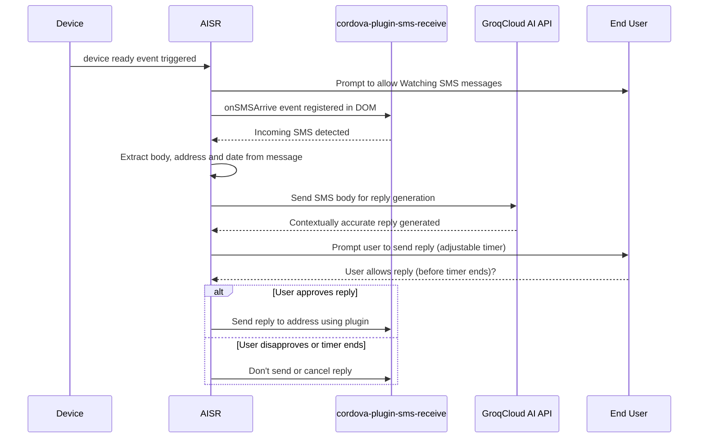

# AISR

   

	AISR is an attempt to employ AI to autonomously generate intelligent and contextually accurate replies to incoming SMS messages on Android and IOS.

---

## How It Works

  
  
step-by-step breakdown

  
  
1. **Device Initialization**: 
   - The app is launched, `deviceready` event is fired, it signifies the app is ready to interact with native plugins and features via cordova.

2. **Registering the SMS Listener**:
   - After firing the `deviceready` event, if SMS watching is started, the event listener ``onSMSArrive`` from ``cordova-plugin-sms-receive`` is registered. This listener is responsible for detecting incoming SMS messages on the device.
   
   > This is assuming that the Phone and SMS permission is allowed.

3. **Capturing Incoming SMS**:
   - When a new SMS message is detected, `onSMSArrive` event is triggered.  We proceed to extract the SMS data, specifically the message body, sender's address and current date.

4. **AI-Powered Response Generation**:
   - The extracted SMS body is sent to Groqcloud AI API that will analyzes the content and generates a contextually accurate reply.
   
   This AI response is tailored to provide a relevant and meaningful reply based on the received message.

5. **User Interaction**:
   - After the AI generates a reply, the app prompts the user to review and approve the response. An adjustable timer is initiated, giving the user a specified amount of time to approve or modify the reply.

6. **Automated Reply**:
   - If the user approves the AI-generated reply within the given time, the app uses the SMS plugin to send the reply back to the original sender. If the timer expires without user intervention, the app can either send the reply automatically or cancel the operation based on predefined settings.

> This process allows for a smooth and automated interaction with SMS messages, enhancing the user experience by combining native device features with advanced AI capabilities.

  

